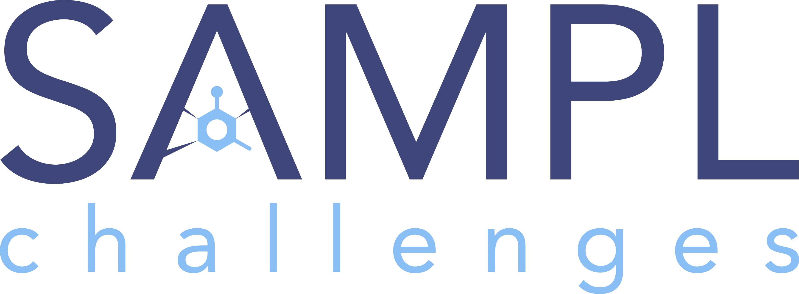





We recently ran the [SAMPL8 physical properties challenge](https://github.com/samplchallenges/SAMPL8/tree/master/physical_properties) on logD and pKa with data from GSK ([dataset collection details here](https://dx.doi.org/10.5281/zenodo.4245127])), with deadlines in Summer 2021. The [SAMPL9 host-guest challenges](https://github.com/samplchallenges/SAMPL9/tree/main/host_guest) are now underway as well, with one completed and another on cyclodextrins in progress as of November, 2021.

We are also running a SAMPL containerized docking methods challenge, where participants submit their methods rather than predictions. This allows us to test methods on equal footing without human intervention. For more information, please see our [github](https://github.com/samplchallenges/SAMPL-containers).

## The 2022 EuroSAMPL Workshop in Germany

In collaboration with the GCC, [we're running a 2022 EuroSAMPL workshop](assets/images/Flyer_GCC-EuroSAMPL_2022_final.pdf) jointly with the 17th German Conference on Cheminformatics, May 8-12, 2022, in Germany. Please see the linked flier for more details.

## SAMPL announcements and interactions

To receive SAMPL e-mail announcements, please sign up for the [SAMPL e-mail list](http://eepurl.com/dPj11j). If interested in a particular challenge, be sure to select the relevant tags (e.g. "SAMPL7", "SAMPL8") on signup, and likewise for particular topic areas (pKa, logP etc.)

[Our SAMPL7 host-guest challenge virtual workshop is up online](https://zenodo.org/record/3674155). And check our the [SAMPL Zenodo community](https://zenodo.org/communities/sampl?page=1&size=20) for additional SAMPL-related content, such as talks from the GCC/EuroSAMPL workshop in Fall 2020. The SAMPL7 physical properties special issue is now also progressing through the review process.

**Data donation**: If you have, or can generate, high quality datasets which might be suitable for a future SAMPL challenge, please contact us, or see our Roadmap page for additional information on types of data which may be of particular interest.

## Acknowledging and citing SAMPL

If you've benefitted from our work on the SAMPL series of challenges, please be sure to acknowledge our SAMPL NIH grant in any publications/presentations. This funded host-guest experiments, as well as our work organizing and administrating these challenges. You may acknowledge SAMPL by saying something like, "We appreciate the National Institutes of Health for its support of the SAMPL project via R01GM124270 to David L. Mobley (UC Irvine)."

We also ask you to cite the SAMPL dataset(s) you used. These are versioned on Zenodo, and a link will be available from the SAMPL repository for the challenge in which you participated.

Of course, we also appreciate it if you cite any overview/experimental papers relevant to the particular SAMPL challenge you participated in.

